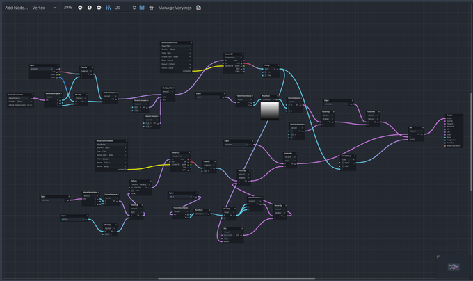

[Recalculating a small area? · Issue #153 · HungryProton/scatter](https://github.com/HungryProton/scatter/issues/153)

> A more complicated solution if you're familiar enough with shaders:
>
> Make a custom spatial shader for the grass, that samples a black and white texture that represents where you placed your objects. (for this example, let's say, black pixels are occupied and white pixels are free space).
>
> In the vertex function of the spatial shader, find the mesh origin in world coordinates, use that to sample the texture above, if the pixel is black, discard the whole instance, otherwise draw it as usual.
>
> To actually generate the texture though, you have a few options, the easiest one would be to use the Image class which has some functions to draw. (Or you can use a viewport and pass the viewport texture to the shader).
>
> That's a lot more involved though, but performance wise, that's probably the best option.

[Bramwell sur Twitter : "Here's how I reworked my grass to support lots of NPC's walking around with global shader textures in Godot 4.1 ✨ [1/7] https://t.co/wkMe3sEafL" / X](https://twitter.com/bramreth/status/1679847039759273986)

> Here's how I reworked my grass to support lots of NPC's walking around with global shader textures in Godot 4.1 ! [1/7]
> I started using the players position as a shader parameter and checking the distance to that point, but doing that for lots of characters is tedious. So I added an extra orthogonal camera under the player that can only see objects on a dedicated visual layer \[2/7\]
> 
> By putting it inside a SubViewport we can get access to what it sees as a ViewportTexture and pass it onto all our shaders as a global shader parameter in Project Settings. (Although I did have to put the Godot icon in as a placeholder) \[3/7\]
> 
> We can set this globally through the RenderingServer, with a script like this one. You need to select a ViewportTexture in the exported player\_trail field and select the viewport containing the orthogonal camera. \[4/7\]
> 
> Now in the Material for our grass we can get the global position of the texture and compare it to the grasses vertex (The grass does need to use World Vertex Coords) and now we have a value for how the texture looks where the grass is! \[5/7\]
> 
> I use the value to move the grass down based on how white the texture is at that point. Finally the player and NPC's needs a mesh with a texture only the orthogonal camera can see as shown in the footstep minimap at the start! [6/7]
> 
> The full shader is still in progress (code for unbearably messy) but this is how I use it. This is my first go at doing something a bit like a tutorial in thread form so hope its helpful or at least interesting ! \[7/7\]
> 
