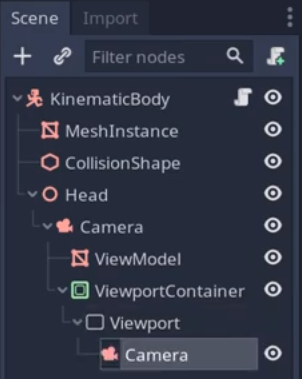

- Camera
  - ViewModel
  - ViewPortContainer
    - Viewport
      - WeaponCamera

ViewModel (weapon) on CullMask 2

Camera Everything but mask 2

WeaponCamera Nothing but mask 2

Possible to change the WeaponCamera Fov independently

source:
https://youtu.be/9i6uxm_ioG0
